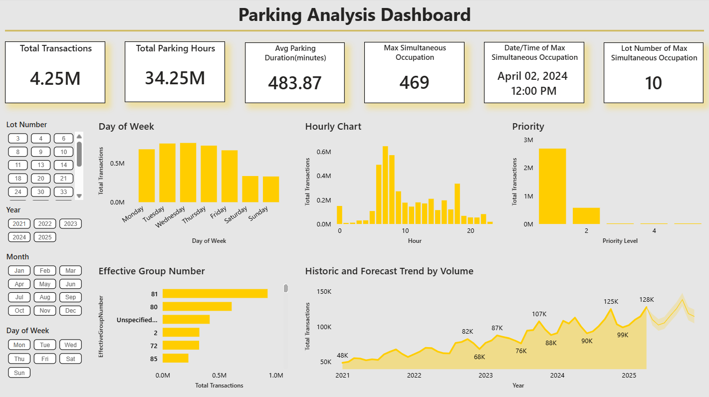

# Parking Utilization Analysis Dashboard

This project delivers a **high-performance Power BI dashboard** built for operational analysis of parking trends and utilization across a network of over **30 parking lots**. The solution utilizes advanced data modeling techniques to efficiently process 
and visualize over **4 million transaction records**.

---

## 💡 Key Features & Technical Execution

The dashboard showcases expertise in the entire BI workflow, from ETL scripting to final visualization:

* **Massive Data Handling:** Successfully modeled and transformed **4 million timestamped transaction records** using optimized Power Query steps, ensuring rapid load times.
* **Advanced DAX Logic:** Utilized **DAX** (Data Analysis Expressions) to create complex calculated KPIs, measure utilization rates, and dynamically generate custom visual labels, improving data readability and reporting speed.
* **Time-Based Filtering:** Integrated **Chiclet Slicers** for intuitive and seamless filtering of utilization data by specific time periods (e.g., peak hours, weekends, or specific days of the week).
* **Operational Analysis:** Provides clear visualizations of occupancy and turnover rates, enabling quick identification of peak demand and underutilized lots for strategic pricing decisions.

---

## 🛠️ Technology Stack

| Category | Tool / Language | Purpose |
| :--- | :--- | :--- |
| **Visualization & Reporting** | **Microsoft Power BI** | Dashboard design, interaction, and final report delivery. |
| **Modeling & Calculation** | **DAX** (Data Analysis Expressions) | Created calculated columns, measures, and core business logic. |
| **ETL & Transformation** | **Power Query (M Language)** | Data cleaning, modeling, and aggregation of raw timestamp data. |
| **Data Aggregation** | **Python (Jupyter Notebook)** | Used for initial data preparation, cleaning, and aggregation logic before ingestion into Power BI. |

---

## 🚀 Repository Contents & Setup

This repository contains the project's source code and structure, built for easy review and local deployment.

| File Name | Purpose |
| :--- | :--- |
| **`Parking_Analysis_Dashboard.pbit`** | **Power BI Template.** Contains the complete visuals, DAX measures, and Power Query steps **without the heavy dataset**. |
| **`Data_Aggregation.ipynb`** | **Python Source Code.** Demonstrates the methodology used for data cleaning and pre-aggregation before Power BI ingestion. |
| **`Clean_Data_Sample.csv`** | **Data Sample.** A small, anonymized extract of the cleaned data for testing the Power Query connections locally. |
| **`Parking_Analysis_Dashboard_Document.pdf`** | **Project Documentation.** Detailed report on methodology, data cleaning steps, and performance findings. |
| **`Parking_Analysis_Dashboard.png`** | **Visual Preview.** Screenshot of the final dashboard design. |

### Local Deployment Steps

1.  **Clone the Repository:**
    ```bash
    git clone [https://github.com/Alvan-Dmello/Paking-Utilization-Dashboard.git](https://github.com/Alvan-Dmello/Paking-Utilization-Dashboard.git)
    cd Parking-Analysis-Dashboard
    ```
2.  **Open the Template:** Open the **`.pbit` file** using Power BI Desktop.
3.  **Load Data:** When prompted, select the included **`Clean_Data_Sample.csv`** file to connect the Power Query steps to the data source and view the working model.

---

## 🖼️ Dashboard Preview

